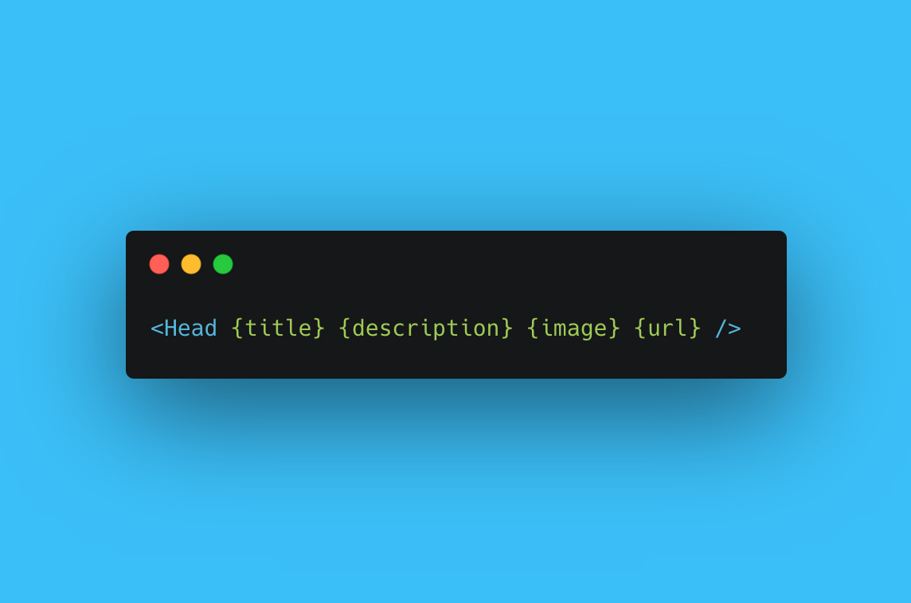

# Svead - Svelte Head Component

<!-- ALL-CONTRIBUTORS-BADGE:START - Do not remove or modify this section -->
[](#contributors-)
<!-- ALL-CONTRIBUTORS-BADGE:END -->

[](https://madewithsvelte.com/p/svead/shield-link)

Svead, a component that allows you to set head meta information,
canonical, title, Twitter and Facebook Open Graph tags.



## Props

It takes the following props:

**Required props**

- `title` => page title
- `description` => page description
- `url` => Full URL of the current page

**Optional props**

- `authorName` => Author Name
- `image` => Open Graph image for use in Twitter, Facebook, etc.
- `paymentPointer` => Web Monetisation Payment pointer
- `website` => Website URL for use in Twitter metatag content.

## Use it

```bash
npm install svead
```

Import it into your Svelte pages and use:

```svelte
<script>
	import { page } from '$app/stores'
	import { Head } from 'svead'

	let title = 'This is Svead a Svelte Head Component'
	let description =
		'Svead, a component that allows you to set head meta information, canonical, title, Twitter and Facebook Open Graph tags.'
	let url = $page.url.toString()
</script>

<Head {title} {description} {image} {url} />
```

## Developing locally

If you have cloned this locally and are making changes to the
component, install it locally (`link:package`) with:

```bash
# package with sveltkit
pnpm run package
# install local package
pnpm i -D ./package
# orr use the script
pnpm package:local
```

## Contributors ✨

Thanks goes to these wonderful people
([emoji key](https://allcontributors.org/docs/en/emoji-key)):

<!-- ALL-CONTRIBUTORS-LIST:START - Do not remove or modify this section -->
<!-- prettier-ignore-start -->
<!-- markdownlint-disable -->
<table>
  <tbody>
    <tr>
      <td align="center" valign="top" width="14.28%"><a href="https://scottspence.com/"><br /><sub><b>Scott Spence</b></sub></a><br /><a href="https://github.com/spences10/svead/commits?author=spences10" title="Code">💻</a> <a href="https://github.com/spences10/svead/commits?author=spences10" title="Documentation">📖</a> <a href="#example-spences10" title="Examples">💡</a> <a href="#maintenance-spences10" title="Maintenance">🚧</a> <a href="https://github.com/spences10/svead/commits?author=spences10" title="Tests">⚠️</a></td>
    </tr>
  </tbody>
  <tfoot>
    <tr>
      <td align="center" size="13px" colspan="7">
        
          <a href="https://all-contributors.js.org/docs/en/bot/usage">Add your contributions</a>
        </img>
      </td>
    </tr>
  </tfoot>
</table>

<!-- markdownlint-restore -->
<!-- prettier-ignore-end -->

<!-- ALL-CONTRIBUTORS-LIST:END -->

This project follows the
[all-contributors](https://github.com/all-contributors/all-contributors)
specification. Contributions of any kind welcome!
